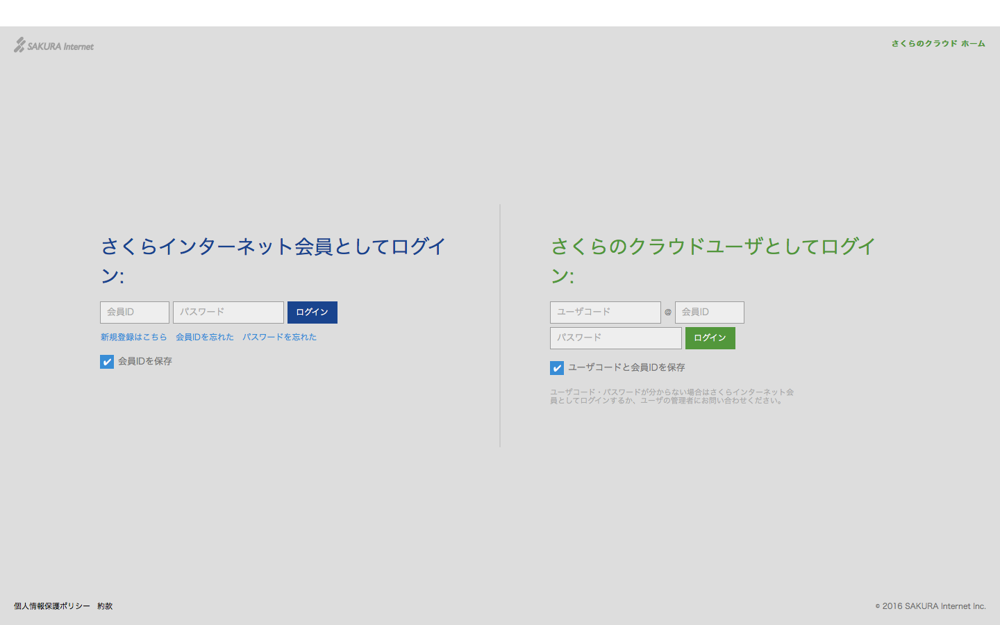
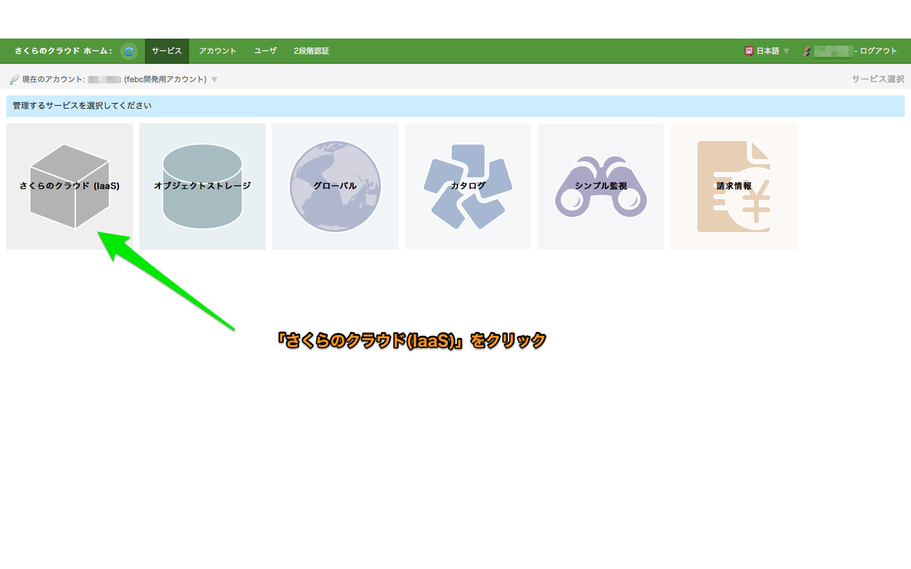
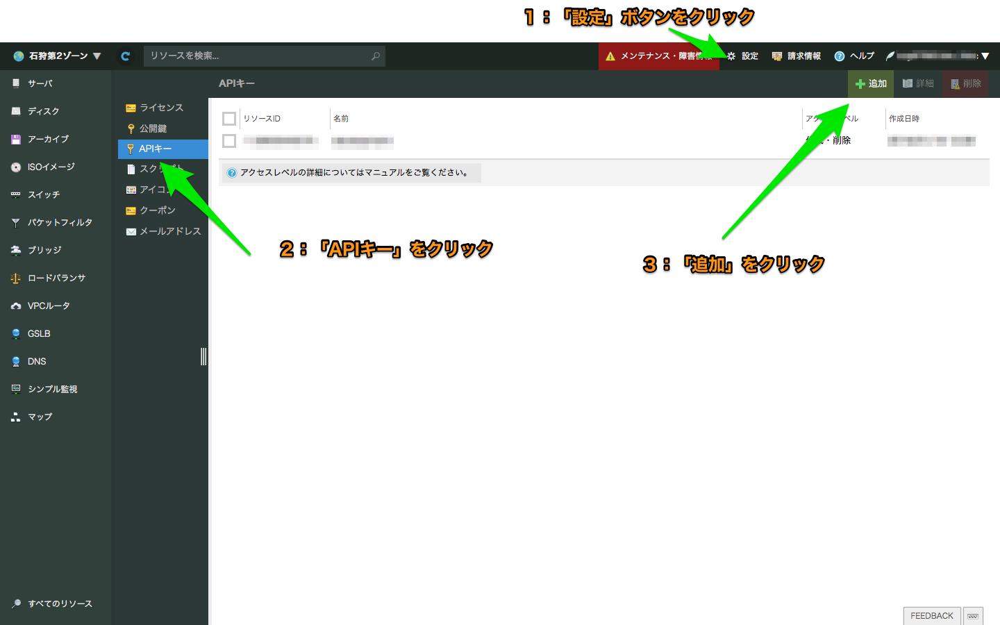
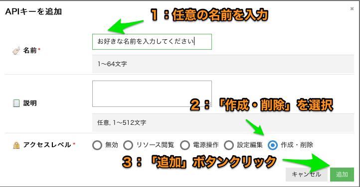
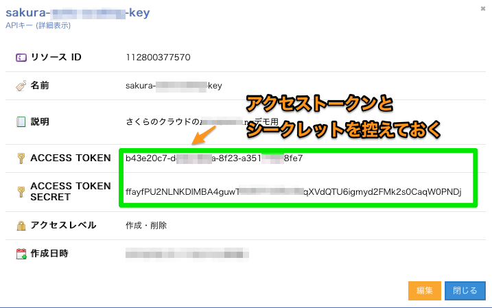

# Installation / インストール

## 目次

1. [Terraformのセットアップ](#terraformのセットアップ)
1. [Terraform for さくらのクラウドのセットアップ](#terraform-for-さくらのクラウドのセットアップ)
1. [さくらのクラウドAPIキーの取得](#さくらのクラウドapiキーの取得)
1. (付録)[Dockerでの実行](#dockerでの実行)

## Terraformのセットアップ

- 1) こちらの[公式サイト](https://www.terraform.io/downloads.html)からzipファイルのダウンロードを行います。
- 2) 適当なディレクトリに展開します。
- 3) 2)のディレクトリにパスを通します。

以下はMacでの例です。展開先ディレクトリは`~/terraform`として記載しています。

#### terraformインストール

```bash
# ~/terraformディレクトリ作成
$ mkdir -p ~/terraform ; cd ~/terraform
# ダウンロード
$ curl -L https://releases.hashicorp.com/terraform/0.7.0/terraform_0.7.0_darwin_amd64.zip > terraform.zip
# 展開
$ unzip terraform.zip
# パスを通す
$ export PATH=$PATH:~/terraform/

```

### 動作確認

`terraform`コマンドを実行してみましょう。
以下のような表示がされればOKです。

#### terraform動作確認 

```bash
$ terraform
usage: terraform [--version] [--help] <command> [<args>]

Available commands are:
    apply       Builds or changes infrastructure
    destroy     Destroy Terraform-managed infrastructure
    get         Download and install modules for the configuration
    graph       Create a visual graph of Terraform resources
    init        Initializes Terraform configuration from a module
    output      Read an output from a state file
    plan        Generate and show an execution plan
    push        Upload this Terraform module to Atlas to run
    refresh     Update local state file against real resources
    remote      Configure remote state storage
    show        Inspect Terraform state or plan
    taint       Manually mark a resource for recreation
    validate    Validates the Terraform files
    version     Prints the Terraform version
```

## Terraform for さくらのクラウドのセットアップ

- 1) こちらの[リリースページ](https://github.com/yamamoto-febc/terraform-provider-sakuracloud/releases/latest)から最新版のzipファイルをダウンロードします。
- 2) terraformと同じディレクトリに展開します。

#### terraform for さくらのクラウド インストール

```bash
$ cd ~/terraform
# ダウンロード
$ curl -L https://github.com/yamamoto-febc/terraform-provider-sakuracloud/releases/download/v0.4.0/terraform-provider-sakuracloud_darwin-amd64.zip > terraform-provider-sakuracloud.zip
# 展開
$ unzip terraform-provider-sakuracloud.zip

```


## さくらのクラウドAPIキーの取得

さくらのクラウドのコントロールパネルにログインしAPIキーを発行します。
以下を参考に実施してください。APIキーを発行したら、`ACCESS_TOKEN`と`ACCESS_TOKEN_SECRET`を控えておきましょう。

#### さくらのクラウド コントロールパネルへのログイン



#### さくらのクラウド(IaaS)を選択



#### APIキー発行画面へ移動



#### APIキーの発行



#### 発行されたAPIキーの確認



## Dockerでの実行

手軽に試せるようにTerraformとTerraform for さくらのクラウドを同梱したDockerイメージを用意しています。

[Terraform for さくらのクラウド Dockerイメージ](https://hub.docker.com/r/sacloud/terraform/)

以下のように実行します。

#### Dockerでの実行
```bash
$ docker run -it --rm \
         -e SAKURACLOUD_ACCESS_TOKEN=[さくらのクラウド APIトークン] \
         -e SAKURACLOUD_ACCESS_TOKEN_SECRET=[さくらのクラウド APIシークレット] \
         -v $PWD:/work \
         sacloud/terraform apply
```

#### docker-composeでの実行
```bash
# あらかじめ以下コマンドで必要な設定ファイルをダウンロード/編集しておく
# curl -LO https://github.com/yamamoto-febc/terraform-for-sakuracloud-docker/raw/master/docker-compose.yml
# curl -L https://github.com/yamamoto-febc/terraform-for-sakuracloud-docker/raw/master/env-sample > .env

$ docker-compose run --rm terraform apply
```
